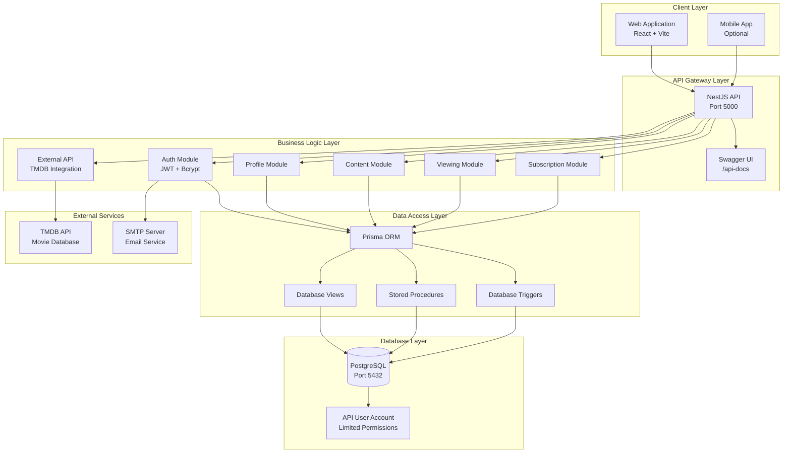

# StreamFlix System Architecture

## Architecture Diagram

## Component Description

### Client Layer
- **Web Application**: React-based SPA that communicates exclusively through the API
- **Mobile App**: Optional mobile client (not implemented in current version)

### API Gateway Layer
- **NestJS API**: RESTful API server handling all client requests
- **Swagger UI**: Interactive API documentation at `/api-docs`

### Business Logic Layer
- **Auth Module**: Handles registration, login, JWT tokens, password reset
- **Profile Module**: Manages user profiles, preferences, age filtering
- **Content Module**: Content library, titles, episodes, search
- **Viewing Module**: Watch history, watchlist, resume watching
- **Subscription Module**: Plans, subscriptions, invitations, discounts
- **External API**: Integration with TMDB for content discovery

### Data Access Layer
- **Prisma ORM**: Type-safe database access
- **Database Views**: Curated data views for security
- **Stored Procedures**: Encapsulated business logic
- **Triggers**: Automated auditing and updates

### Database Layer
- **PostgreSQL**: Relational database in 3NF
- **API User Account**: Dedicated database user with limited permissions

## Data Flow

1. **Client Request**: User interacts with web application
2. **API Processing**: Request validated, authenticated, routed to appropriate module
3. **Business Logic**: Module processes request, may call external APIs
4. **Data Access**: Prisma ORM or stored procedures access database
5. **Database**: PostgreSQL executes queries through views/procedures
6. **Response**: Data formatted (JSON/XML/CSV) and returned to client

## Security Layers

1. **Authentication**: JWT tokens for user sessions
2. **Authorization**: Role-based access control (JUNIOR, MID, SENIOR)
3. **Database Security**: API user with limited permissions, views for data isolation
4. **Input Validation**: class-validator validates all inputs
5. **Rate Limiting**: Prevents abuse
6. **Helmet**: Security headers

